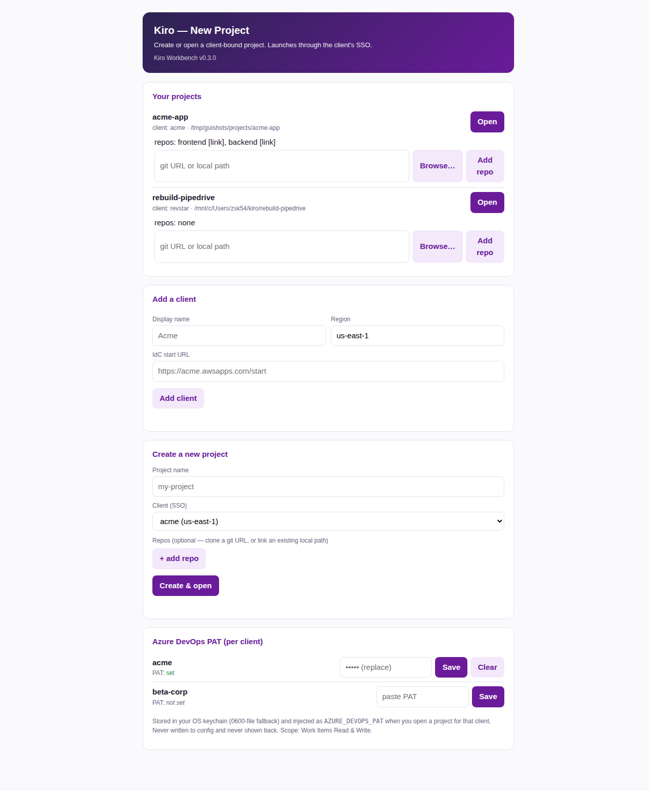
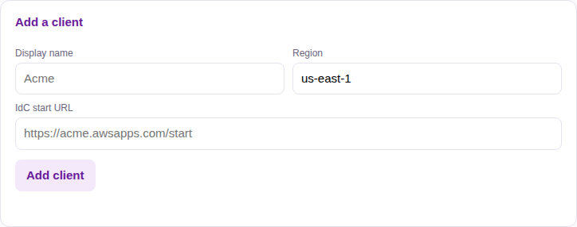
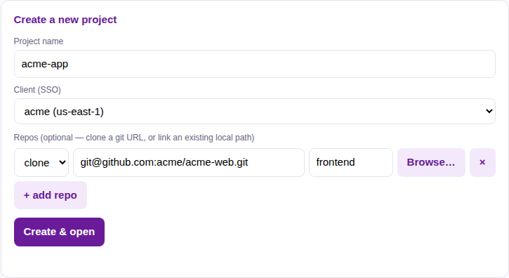
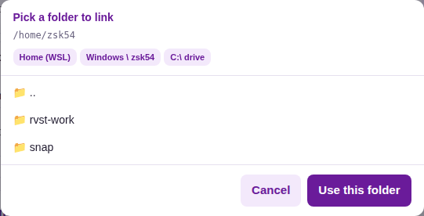
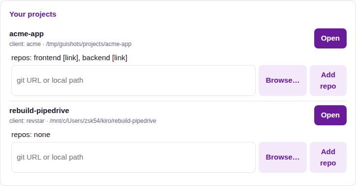
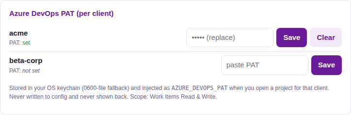

import { Tabs, TabItem, Aside, Steps, LinkCard } from '@astrojs/starlight/components';

This is the complete install-and-setup guide: get the tooling on your machine,
then drive everything from the **desktop app** — clients, projects, repo links
and your Azure DevOps PAT.

<LinkCard
  title="Full reference: INSTALL.md on GitHub"
  description="The authoritative, always-current install reference (v1 branch)."
  href="https://github.com/revstarconsulting/rvst-cli/blob/v1/INSTALL.md"
/>

## 1. Prerequisites

- **Node.js 18+**
- **git** with access to the private repos (SSH key or `gh` login)
- **[Kiro CLI](https://kiro.dev)** (`kiro-cli`) installed and on your `PATH`
- **Windows only:** WSL2 with a Linux distro (the CLI runs inside WSL)

## 2. Get the two repos

Kiro Workbench ships as two repos, cloned **side by side**:

```sh
git clone https://github.com/revstarconsulting/rvst-cli.git
git clone https://github.com/revstarconsulting/rvst-registry.git
```

`rvst-cli` holds the `kiroctl` CLI and installers; `rvst-registry` holds the
content pack (agents, skills, gates, steering).

<Aside type="caution" title="Use git clone — not a “Download ZIP”">
A GitHub ZIP download strips the executable bits off the installer scripts and
gives you no `kiroctl update` path — a zip-based install **silently skips the
desktop launcher**. Always `git clone`.
</Aside>

<Aside type="tip" title="Let your Kiro do it">
You can hand this to an existing Kiro session:

> `git clone` https://github.com/revstarconsulting/rvst-cli.git and
> https://github.com/revstarconsulting/rvst-registry.git side by side, then from
> inside `rvst-cli` run the installer for my OS with
> `KIRO_REGISTRY_ROOT=../rvst-registry`. Then verify with `kiroctl doctor` and
> `kiroctl doctor --governance`. Don't commit any secrets.
</Aside>

## 3. Run the installer

From inside `rvst-cli`, point the installer at your `rvst-registry` clone:

<Tabs syncKey="os">
  <TabItem label="macOS" icon="apple">
    ```sh
    KIRO_REGISTRY_ROOT=../rvst-registry ./installers/install-macos.sh
    ```
  </TabItem>
  <TabItem label="Linux" icon="linux">
    ```sh
    KIRO_REGISTRY_ROOT=../rvst-registry ./installers/install-linux.sh
    ```
  </TabItem>
  <TabItem label="Windows" icon="seti:windows">
    Run in PowerShell (it provisions the WSL side and the Windows launcher):
    ```powershell
    $env:KIRO_REGISTRY_ROOT="..\rvst-registry"
    .\installers\install-windows.ps1
    ```
  </TabItem>
</Tabs>

Add `--arm-safe` to also arm the inject-only gates (they can't block anything —
they only inject mission state and write turn receipts).

### What the bootstrap does

1. Copies `steering/` and `skills/` from the registry into `$KIRO_HOME`.
2. Writes the `dev`, `coder`, and `scout` agent configurations.
3. Sets `chat.defaultAgent` to `dev`.
4. Asserts the model pins (Opus for `dev`, Sonnet for `coder`/`scout` — never
   Haiku, never `auto`).
5. Runs the governance guard against the registry's rules.
6. Wires the Playwright and Azure DevOps MCP servers.
7. Links the `kiroctl` binary onto your `PATH` and installs the desktop launcher.
8. Records an install manifest so `kiroctl doctor`/`kiroctl update` know the layout.

## 4. Verify

```sh
kiroctl doctor
node ../rvst-registry/kiro/gates/selftest.js
kiroctl doctor --governance
```

`kiroctl doctor` reports the install is healthy; the gate selftest prints
**60/60**; governance reports **OK**.

---

## 5. Use the desktop app

Everything day-to-day happens in the **Kiro project GUI** — one identical local
web app on macOS, Windows and Linux. Launch it from the **“Kiro - New Project”**
desktop icon the installer created, or run:

```sh
kiroctl gui
```

It opens in your default browser on `127.0.0.1` (loopback only, gated by a
per-launch token). From here you add clients, create projects, link repos, and
manage your Azure DevOps PAT.



### 5a. Add a client

A **client** is one AWS Identity Center (SSO) boundary — its own isolated
credential store. Add one per AWS account you work in.



- **Display name** — e.g. `Acme` (used to derive the client slug).
- **Region** — the client's AWS region, e.g. `us-east-1`.
- **IdC start URL** — the Identity Center start URL, e.g. `https://acme.awsapps.com/start`.

<Aside type="note">
Switching clients never mixes credentials — a project bound to one client can't
authenticate against another. The client governs **AWS/Kiro SSO only**, not GitHub.
</Aside>

### 5b. Create a project and link its repos

Give the project a name, pick its client, then add one or more **repos**. A
project can span several repos (e.g. a frontend and a backend), so one Kiro
session works across all of them.



Each repo row is one of:

- **clone** — paste a **git URL**; it's cloned into the project workspace.
- **link** — point at an **existing local clone**; it's symlinked in.

<Aside type="caution" title="Cloning uses your own git credentials">
Private-repo clones use your existing git/GitHub credentials (SSH or `gh`). A URL
with an embedded credential (`https://user:token@…`) is **rejected** — use SSH or
a credential helper.
</Aside>

#### Browse for a local path

For a **link**, click **Browse…** to pick the folder instead of typing it. Under
WSL the picker gives you quick-jump shortcuts to your **Windows** filesystem
(`C:\Users\…`) as well as the WSL home — folders that are git repos are flagged.



Click **Create & open** and the project opens in a terminal — Kiro logs in via
the client's SSO, clones any missing repos, and launches the session over the
whole workspace.

### 5c. Add repos to an existing project

Every project in **Your projects** shows its repos and an inline **Add repo**
box (with its own **Browse…**), so you can attach more repos any time. Use
**Open** to launch a project's session.



### 5d. Set the Azure DevOps PAT (per client)

Reporting work to Azure DevOps needs your **own** PAT (Work Items Read & Write),
stored **per client**. Paste it once in the PAT card; it's saved to your OS
keychain (with a `0600`-file fallback), injected as `AZURE_DEVOPS_PAT` when you
open a project for that client, and **never shown back** or written to config.



<Aside type="tip">
Prefer the CLI? `kiroctl client set-pat --slug <client>` reads the PAT from stdin
(never the argument list).
</Aside>

---

## 6. Updating later

```sh
kiroctl update
```

A verified pull of both repos + reinstall — bolt-on, never subtract, so your own
customizations are preserved. Restart your Kiro session afterward so steering,
skills and MCP servers reload. (On Windows, run it inside WSL.)

## Next step

Continue to [Your first project](/start/first-run/) for the client → project →
open flow, including multi-repo projects.
